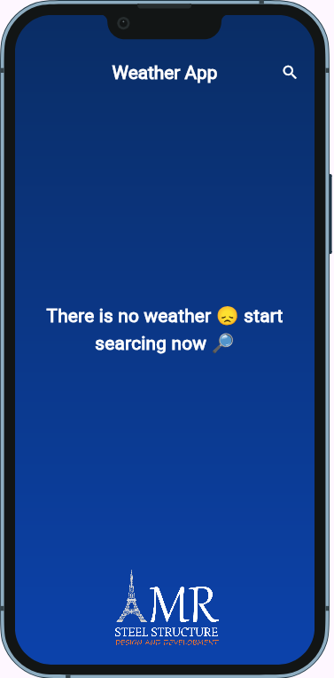
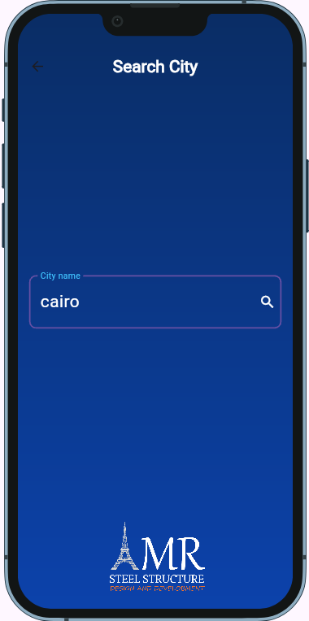
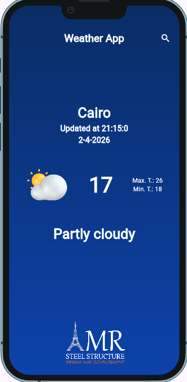

🌦️ Weather App

A beautiful and responsive weather application built using Flutter that displays real-time weather data with clean UI and smooth performance

📱 Features
🌍 Get weather by city name
☀️ Display current weather condition
🌡️ Show temperature (current, max, min)
🌤️ Dynamic weather icons based on condition
⚡ Fast and responsive UI
🌐 Works on Web & Mobile

🖼️ Screenshots

🔑 API Used
This app uses a Weather API to fetch real-time data.
Example: WeatherAPI.com

👨‍💻 Author
Amr Khalifa
